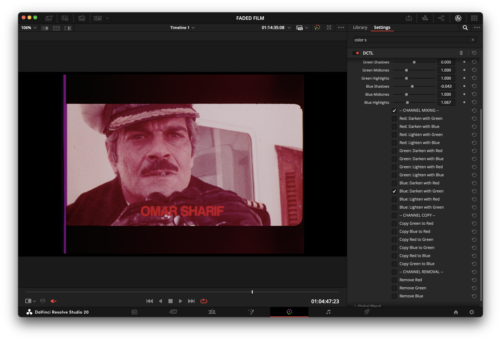
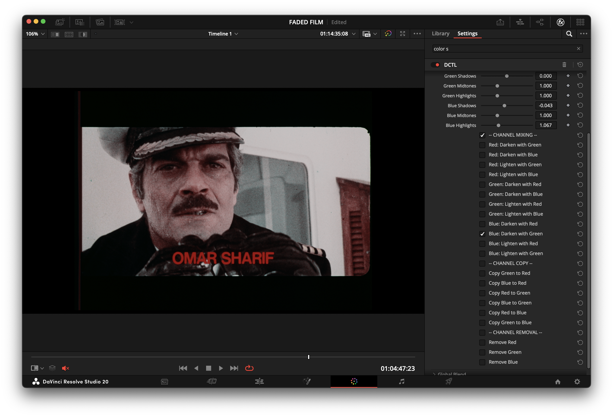
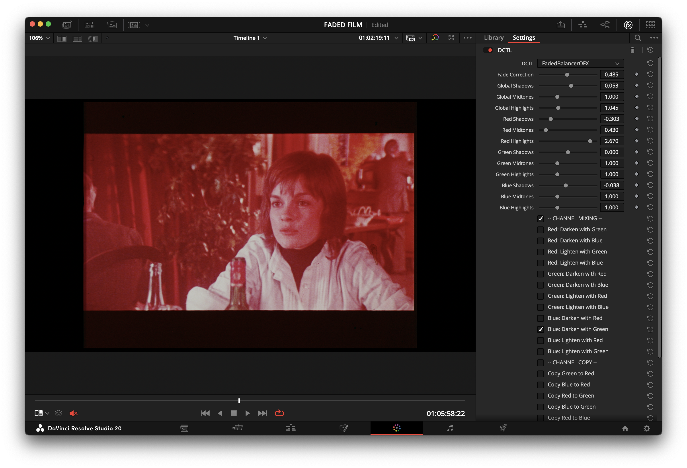
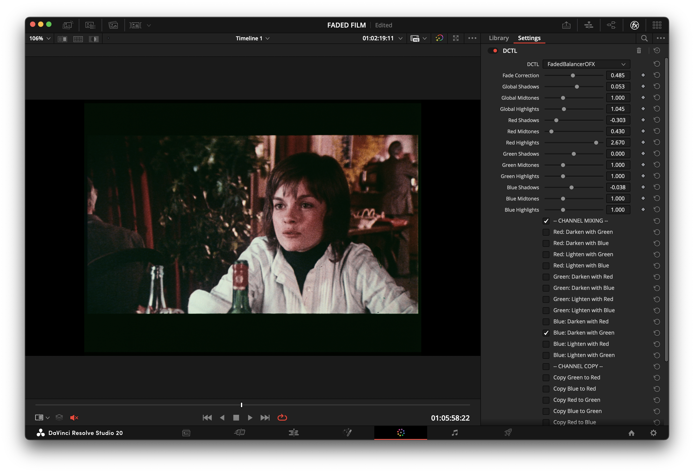

# FadedBalancerOFX

A DaVinci Resolve DCTL OFX plugin for balancing RGB channels and correcting faded film scans. It provides accessible and flexible tools for channel adjustment, mixing, and restoration preparation.

---

### Version

**v1.1.0**
-   **macOS:** Fully compatible.
-   **Windows:** Fully compatible.
-   **Linux:** Not yet tested.

---

### Features

-   **Film Fade Correction:** A dedicated tool to correct faded footage by adaptively enhancing contrast and saturation.
-   **Global & Per-Channel Balance:** Adjust Lift, Gamma, and Gain for all channels together or individually.
-   **Channel Mixing:** Mix channels by taking the minimum or maximum values between them (e.g., `Red = min(Red, Green)`).
-   **Channel Copy & Removal:** Easily copy data between channels or remove a channel entirely.
-   **Optimized Processing:** All calculations are performed in 32-bit float, with a single clamp at the end of the pipeline to preserve maximum dynamic range and prevent data clipping.

---

### Before & After

Here are a few examples showcasing the plugin's effectiveness in correcting faded film scans.

**Example 1: Captain Scene**
| Before | After |
| :---: | :---: |
|  |  |

**Example 2: Beach Scene**
| Before | After |
| :---: | :---: |
|  |  |

**Example 3: Table Scene**
| Before | After |
| :---: | :---: |
|  |  |

---

### Intended Use

FadedBalancerOFX is designed for archivists, restoration specialists, and anyone working with digitally scanned film that exhibits dye fading or other channel imbalances. While it cannot restore lost color information, it provides the essential tools to neutralize color casts and prepare footage for further restoration work.

---

### Installation

1.  Download `FadedBalancerOFX.dctl`.
2.  Place it in your DaVinci Resolve LUT folder:
    -   **Windows:** `C:\ProgramData\Blackmagic Design\DaVinci Resolve\Support\LUT\`
    -   **macOS:** `/Library/Application Support/Blackmagic Design/DaVinci Resolve/LUT/`
3.  Restart DaVinci Resolve.
4.  In the Color page, add a "DCTL" effect to a node and select `FadedBalancerOFX` from the dropdown menu.

---

### Usage

-   **Fade Correction:** Start with the "Fade Correction" slider to globally improve contrast and saturation.
-   **Channel Balance:** Use the "Global" sliders for overall adjustments, then fine-tune with the individual Red, Green, and Blue controls.
-   **Channel Mixing/Copy:** Use these tools to manage severe color casts. For example, on a film where the cyan dye has faded (leaving a red cast), you can mix or copy the green or blue channels into the red channel to neutralize the image.

### Workflow Recommendations

To achieve the best results and preserve maximum image fidelity, consider the following workflow:

*   **Preserve Dynamic Range:** Place a Color Space Transform (CST) node immediately *after* the FadedBalancerOFX effect. Set the CST's output to a logarithmic space like "Cineon Film Log". This ensures that any adjustments you make do not clip highlight or shadow detail, preserving the full dynamic range of your footage.

*   **Avoid Clipping in Red Channel:** When dealing with significant red channel imbalances (common in faded film), it is often better to use the `Red Midtones` control for the primary correction. Using `Red Shadows` (lift) can sometimes crush shadow detail, whereas adjusting the midtones offers a gentler re-balance.

### Video Demonstration

For a visual guide on how to use the plugin, check out the video tutorial below:

---

### License

[MIT License](LICENSE)

---

### Credits

Developed by Fabio Bedoya.

---

### Acknowledgements

The "Film Fade Correction" feature was partially inspired by insights from the following paper, which provided a valuable foundation for the approach used:

-   Trumpy, G., Flueckiger, B., & Goeth, A. (2023). *Digital Unfading of Chromogenic Film Informed by Its Spectral Densities*. [Link to paper](https://ntnuopen.ntnu.no/ntnu-xmlui/handle/11250/3101572)

---

### Support the Project

If you find this plugin useful and would like to support its ongoing development, please consider making a donation. Your support is greatly appreciated!

[Donate via PayPal](https://paypal.me/fabiocolor)
